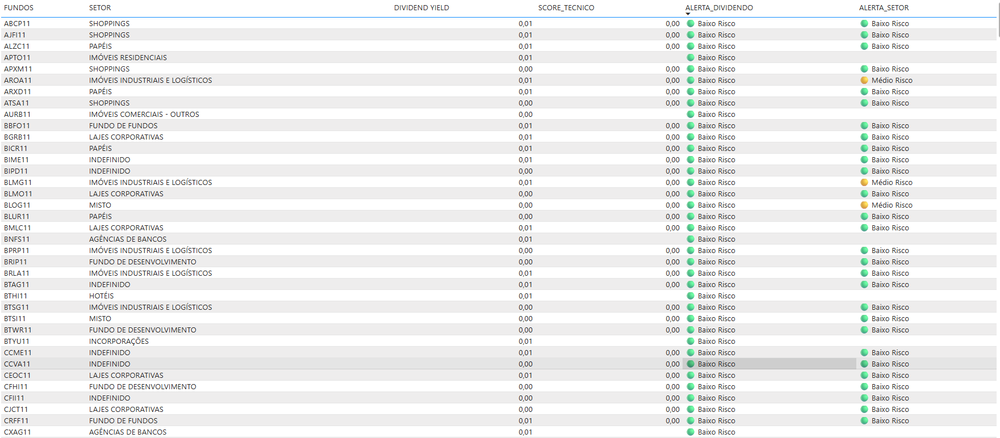
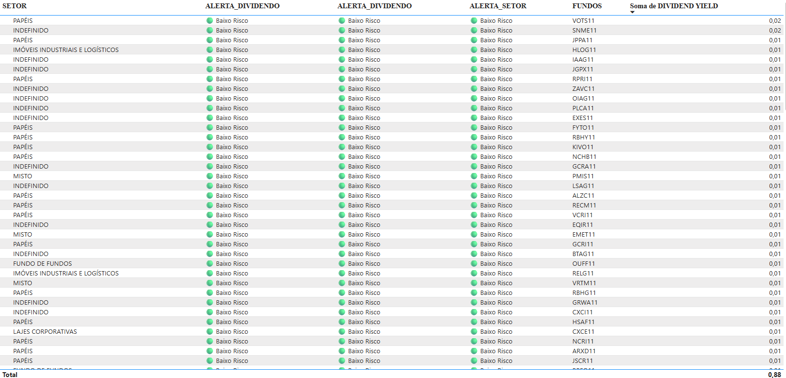

# 📊 fii-risk-analysis

Análise de risco de Fundos Imobiliários brasileiros utilizando  
**Web Scraping, Machine Learning não supervisionado (Isolation Forest) e Power BI**.

---

## 🎯 Objetivo do Projeto

Este projeto tem como objetivo analisar Fundos Imobiliários (FIIs) negociados no Brasil,
utilizando **dados públicos** para criar **alertas de risco relacionados a dividendos
e setores de atuação**.

A proposta **não é prever preços ou recomendar investimentos**, mas sim
**organizar informações, identificar comportamentos atípicos e facilitar análises exploratórias**,
de forma clara e visual.

---

## 🔍 Fonte dos Dados

Os dados foram coletados a partir de informações públicas disponibilizadas no site:

🔗 https://www.fundsexplorer.com.br

A coleta foi realizada exclusivamente para **fins educacionais e analíticos**.

---

## 🧩 Pipeline do Projeto

### 1️⃣ Coleta de Dados (Web Scraping)
- Extração da tabela de FIIs do Funds Explorer
- Coleta de indicadores como:
  - Dividend Yield
  - Liquidez diária
  - P/VP
  - Número de cotistas
  - Setor de atuação

### 2️⃣ Limpeza e Preparação dos Dados
- Conversão de valores monetários e percentuais
- Tratamento de dados ausentes
- Padronização de colunas para análise

### 3️⃣ Alerta de Risco de Dividendos (Machine Learning)
- Aplicação do algoritmo **Isolation Forest**
- Identificação de comportamentos atípicos por FII
- Classificação em:
  - 🔴 Alto Risco
  - 🟡 Risco Moderado
  - 🟢 Baixo Risco

### 4️⃣ Alerta de Risco por Setor
- Análise setorial com Isolation Forest
- Avaliação do risco estrutural dentro de cada setor
- Geração de:
  - `ALERTA_SETOR`
  - `SCORE_TECNICO` (indicador agregado de qualidade)

### 5️⃣ Exportação para Power BI
- Consolidação final dos dados
- Geração de arquivo Excel para visualização
- Base única para criação do dashboard

📊 Arquivo gerado: `outputs/fii_dashboard_powerbi.xlsx`

---

## 📈 Dashboard (Power BI)

Os resultados são apresentados em um dashboard interativo no Power BI,
com foco em **clareza visual e interpretação simples**, mesmo para usuários não técnicos.

### 🔴🟡🟢 Alertas de Risco

### 🏢 Análise por Setor

---

## 🛠️ Tecnologias Utilizadas
- Python (Pandas, NumPy, Scikit-learn)
- Web Scraping (Selenium)
- Machine Learning não supervisionado (Isolation Forest)
- Power BI
- Jupyter / Google Colab (fase exploratória)

---

## ⚠️ Aviso
Este projeto possui **finalidade educacional e analítica** e **não constitui recomendação de investimento**.
